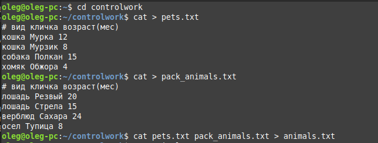
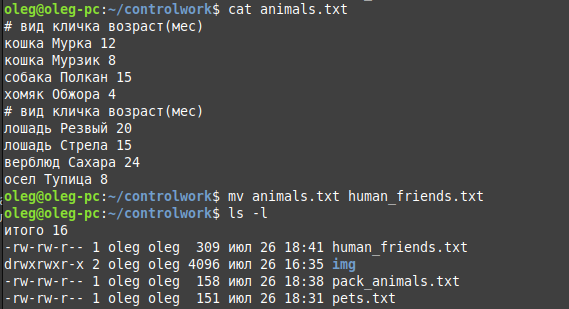
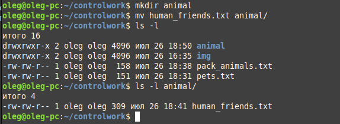
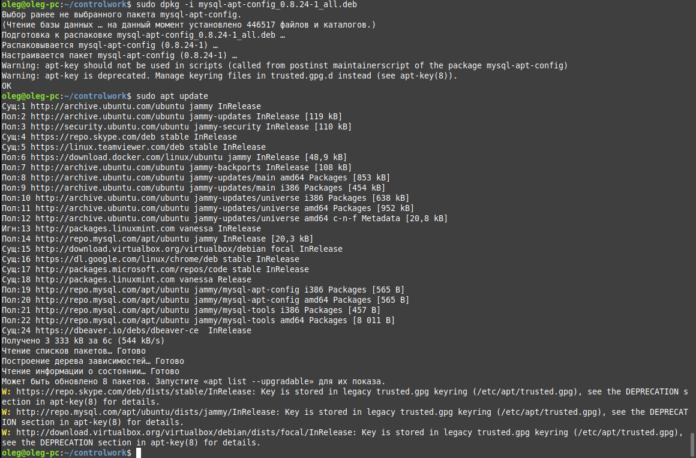
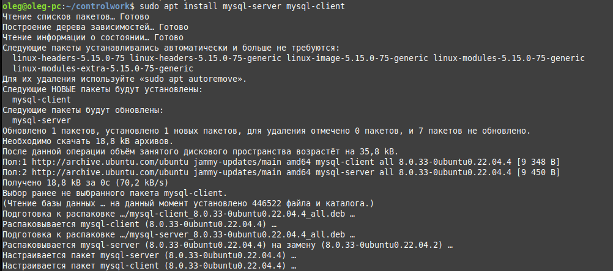
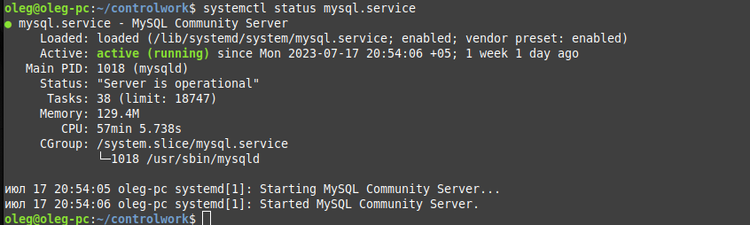
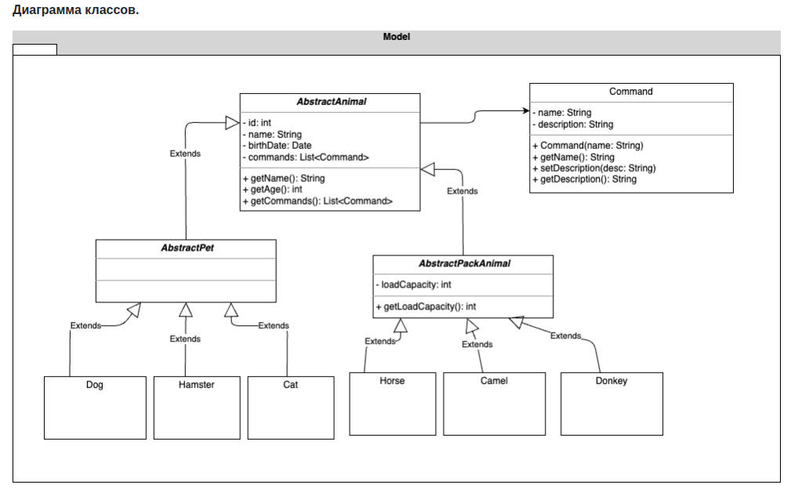
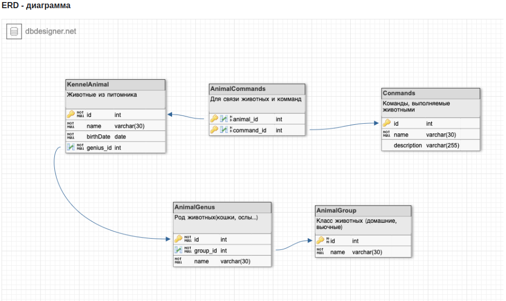

# Итоговая контрольная работа по специализации "Программист"

## Информация о проекте

- Необходимо организовать систему учета для питомника в котором живут домашние и вьючные животные.

## Как сдавать проект

- Для сдачи проекта необходимо создать отдельный общедоступный репозиторий.
- Разработку вести в этом репозитории, использовать пул реквесты на изменения.
- Программа должна запускаться и работать, ошибок при выполнении программы быть не должно.
- Программа, может использоваться в различных системах, поэтому необходимо разработать класс в виде конструктора.

## Задание

### Блок по работе с терминалом в OS Linux

- Операции с файлами:
    1. Используя команду cat, создать файл "Домашние животные", с данными: собаки, кошки, хомяки.
    Создать файл "Вьючные животные", с данными: лошади, верблюды, ослы.
    Объединить созданные файлы.

        

    2. Вывести содержимое созданного файла.
    Переименовать файл в "Друзья человека".

        

    3. Создать директорию, переместить в нее файл.

        

    4. Подключить дополнительный репозиторий MySQL.
    Установить любой пакет из подключенного репозитория.

        

        

        

    5. Установить и удалить deb-пакет с помощью dpkg.

        oleg@oleg-pc:~/controlwork$ sudo dpkg -i mysql-apt-config_0.8.24-1_all.deb  
        oleg@oleg-pc:~/controlwork$ sudo dpkg -r mysql-apt-config  
        oleg@oleg-pc:~/controlwork$ sudo dpkg --purge mysql-apt-config  

# Блок по работе с диаграммами

- Нарисовать диаграмму, в которой есть классы: родительский класс, домашние животные и вьючные животные, в составы которых в случае домашних животных войдут классы: собаки, кошки, хомяки, а в класс вьючные животные войдут: лошади, верблюды и ослы.  
        
        

# Блок по работе с SQL в СУБД MySQL  

1. В подключенном MySQL репозитории создать базу данных “Друзья
человека”:  

    CREATE DATABASE IF NOT EXISTS HumanFriends;  
    USE HumanFriends;

2. Создать таблицы с иерархией из диаграммы в БД:  

    CREATE TABLE Commands  
    (  
    >id INT PRIMARY KEY NOT NULL AUTO_INCREMENT,  
        name varchar(30),  
        description varchar(255)  

    );

    CREATE TABLE AnimalGroup  
    (  
    >id INT PRIMARY KEY NOT NULL AUTO_INCREMENT,  
    name varchar(30)  

    );

    CREATE TABLE AnimalGenius  
    (
    >id INT PRIMARY KEY NOT NULL AUTO_INCREMENT,  
    name varchar(30),  
    group_id INT,  
    FOREIGN KEY (group_id) REFERENCES AnimalGroup (id)  
    ON DELETE CASCADE ON UPDATE CASCADE  

    );

    CREATE TABLE KennelAnimal  
    (
    >id INT PRIMARY KEY NOT NULL AUTO_INCREMENT,  
    name varchar(30),  
    birthDate DATE,  
    genius_id INT,  
    FOREIGN KEY (genius_id) REFERENCES AnimalGenius (id)  
    ON DELETE CASCADE ON UPDATE CASCADE  

    );

    CREATE TABLE AnimalCommands  
    (
    >animal_id INT NOT NULL,  
    command_id INT NOT NULL,  

    >PRIMARY KEY (animal_id, command_id),  
    FOREIGN KEY (animal_id) REFERENCES KennelAnimal (id)  
     ON DELETE CASCADE ON UPDATE CASCADE,
    FOREIGN KEY (command_id) REFERENCES Commands (id)
     ON DELETE CASCADE  ON UPDATE CASCADE  

    );

# Блок "Программирование"

- Создать класс с Инкапсуляцией методов и наследованием по диаграмме.
- Написать программу, имитирующую работу реестра домашних животных. В программе должен быть реализован следующий функционал:
    1. Завести новое животное.
    2. Определять животное в правильный класс.
    3. Увидеть список команд, которое выполняет животное.
    4. Обучить животное новым командам.
    5. Реализовать навигацию по меню.
- Создайте класс-счетчик, у которого есть метод add(), увеличивающий̆ значение внутренней̆int переменной̆на 1 при нажатие “Завести новое
животное” Сделайте так, чтобы с объектом такого типа можно было работать в
блоке try-with-resources. Нужно бросить исключение, если работа с объектом
типа счетчик была не в ресурсном try и/или ресурс остался открыт. Значение
считать в ресурсе try, если при заведения животного заполнены все поля.
